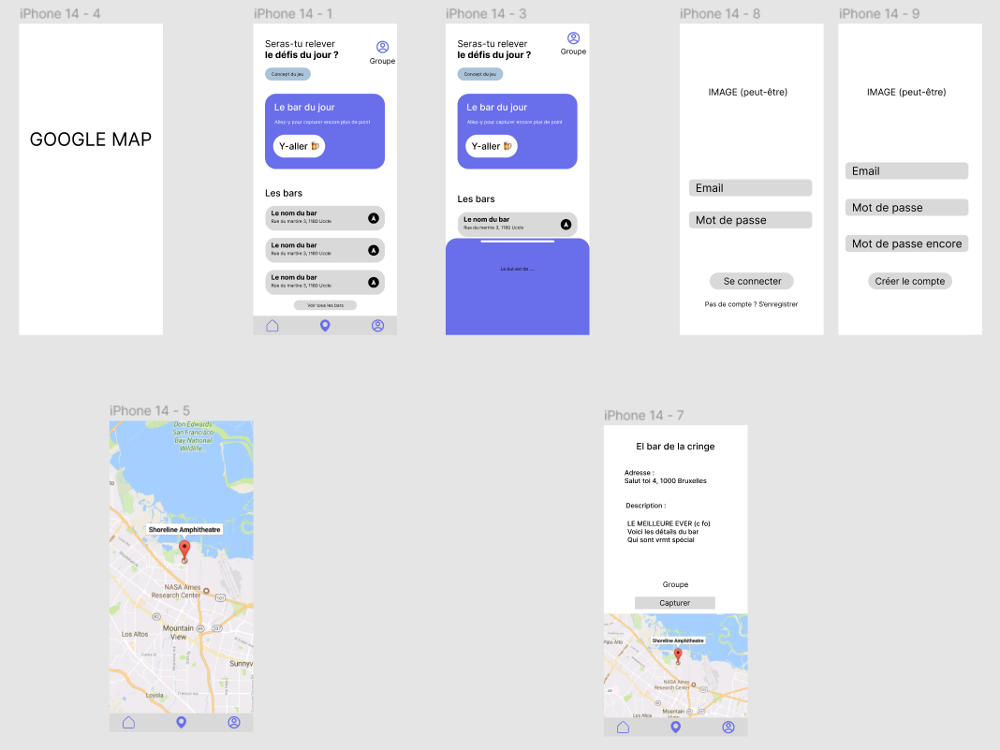
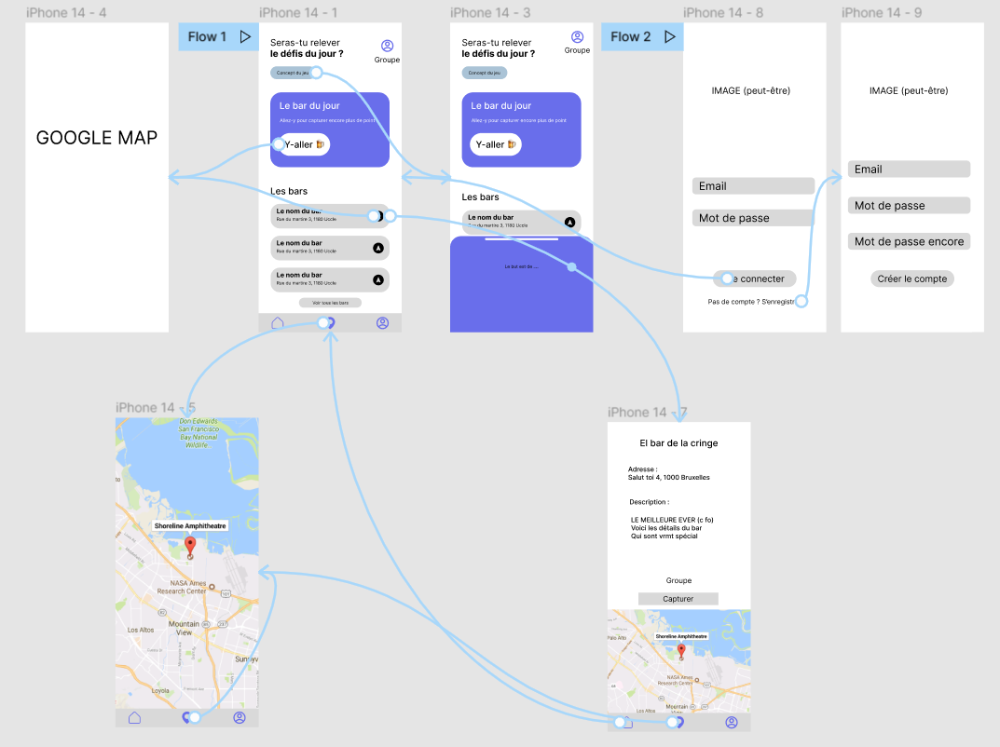

# Projet CaptiBar | Capturer les tous le plus rapidement possible

Ce dépôt contient les sources du projet CaptiBar.

## Description

L'application CaptiBar est un capture de bar. Il permet de trouver un bar n'ayant pas encore été capturés et principalement de découvrir de nouveau bars locaux.

Le but étant de trouver les nouveaux bars que vous n'avez pas encore fait.

L'application redirigera vers Google Map pour permettre à l'utilisateur de ce dirigé vers le bar de son choix.

Une fois y être aller et avoir attendu, la capture est validé et pourra passer aux prochains si il le souhaite.

Pour l'instant, l'utilisateur devra se **connecter** pour pouvoir valider une capture et valider **soit même** la capture.

## Persistance des données

Les données relatives aux bars, bar du jour sont persistées via firebase.

## Service rest

Pour collecter les données relative aux bars, elles sont trouvables via l'api de Google dans la catégorie 'Place search' ou bien via l'api de Bruxelles Open Data dans la catégorie 'Bars'.


## Image de l'application

Voici l'ensemble de l'application et ses différentes pages :



La navigation entre chaque page est marqué via une flèche :




## Installation

**Important !!! Lors de la création du fichier _local.properties_ ajouté la ligne suivante :**

```
MAPS_API_KEY=your-google-api-key
```


## Problèmes pouvant survenir

Un problème qui peut survenir est lorsque vous appuyer sur la map dans la navigation du bas.
Si l'application se fermes, c'est que vous n'avez pas mis la clé API de Google Map dans le fichier _local.properties_ ou bien qu'il faudra réinstaller l'application dû à un problème de cache.

## Auteur

**Routier Basile** 54018
